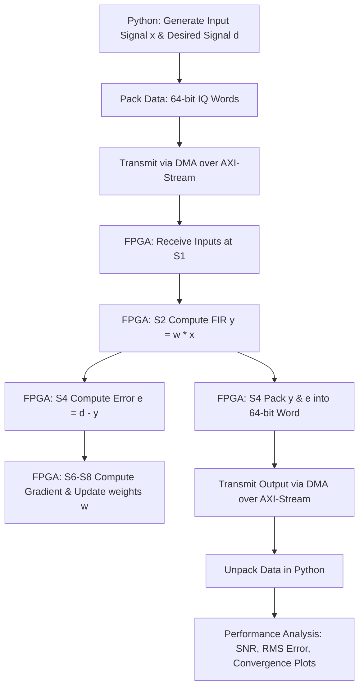

# FPGA-Accelerated LMS Beamforming

## Short Project Summary
This repository contains a high-performance, FPGA-accelerated Least Mean Squares (LMS) adaptive filter pipeline designed for real-time beamforming applications. The project implements both 1-Tap and 4-Tap complex-valued LMS designs deployed on a Xilinx Zynq-7020 SoC. It integrates bit-accurate Python simulations (software golden model), cycle-accurate Verilog/RTL hardware implementations, Vivado IP block designs, automated DMA streaming interfaces, and final physical FPGA artifacts (bitstreams `.bit` and hardware handoffs `.hwh`).

---

## Overview of LMS Beamforming
Adaptive beamforming is a signal processing technique used in sensor arrays (such as antenna arrays) to dynamically adjust the spatial reception or transmission pattern. By continuously updating complex weight factors applied to the signals from each sensor element, the beamformer steers the main lobe toward the signal of interest (SOI) while forming nulls toward interferers and sources of noise. 

The Least Mean Squares (LMS) algorithm is an iterative stochastic gradient descent approach widely used in adaptive filtering due to its computational simplicity and robustness. The algorithm updates the filter weights according to:

$$\mathbf{w}(n+1) = \mathbf{w}(n) + \mu \, e(n) \, \mathbf{x}^*(n)$$

where:
* $\mathbf{w}(n)$ is the vector of complex weights at time index $n$.
* $\mu$ is the adaptation step-size parameter.
* $e(n) = d(n) - y(n)$ is the instantaneous complex error signal between the desired training signal $d(n)$ and the filter output $y(n) = \mathbf{w}^H(n)\mathbf{x}(n)$.
* $\mathbf{x}(n)$ is the input signal vector, and $\mathbf{x}^*(n)$ is its complex conjugate.

Accelerating this computation on an FPGA fabric permits low-latency, deterministic execution of weight updates and FIR filtering, which is critical for real-time, high-bandwidth communication and radar systems.

---

## Key Features
* **Hardware-Software Co-Design (PS/PL Integration):** Uses Xilinx DMA to stream complex IQ data blocks between the ARM Cortex-A9 Processing System (PS) and the FPGA Programmable Logic (PL) fabric.
* **Dual Architecture Implementation:**
  * **1-Tap LMS:** Lightweight design tailored for single-path phase/amplitude alignment.
  * **4-Tap LMS:** Pipelined complex-valued design to mitigate multi-tap Inter-Symbol Interference (ISI) in multipath channels.
* **Strict Bit-Accuracy Verification:** Validated by comparing hardware-in-the-loop (HIL) executions against equivalent fixed-point Python software simulations.
* **PYNQ-Z2 Framework Compatibility:** Real-time data streaming and control via Python using Jupyter notebooks and PYNQ DMA APIs.
* **Robust Timing Closure:** Deeply pipelined RTL arithmetic elements designed to meet clock constraints at high execution frequencies.

---

## Repository Structure
```text
FPGA-Accelerated-LMS-Beamforming/
├── 1 tap/
│   ├── hardware/                     # 1-Tap hardware simulation scripts and hardware photos
│   ├── software/                     # 1-Tap software model and offline simulation results
│   └── verilog/                      # 1-Tap LMS RTL implementation (lms_singletap_iq.v)
├── 4 tap/
│   ├── hardware/                     # 4-Tap hardware verification scripts and board run photos
│   ├── software/                     # 4-Tap software reference model and convergence verification
│   └── verilog/                      # 4-Tap LMS RTL design (4_tap.v)
├── comparing/
│   └── comparing_single_tap_to_4_tap.md # Detailed analysis of software vs. hardware execution performance
├── docs/
│   └── images/                       # Vivado block designs and report captures
│       ├── one_tap/
│       └── four_tap/
├── final .bit and .hwh/              # Bitstream and hardware handoff files for deployment
│   ├── 4 tap/
│   └── single tap/
├── USRP/
│   └── 1TAP/                         # USRP SDR interfacing directory
└── README.md                         # Project documentation
```

---

## System Architecture / Hardware-Software Flow
The project utilizes a co-design methodology where signal generation, channel modeling, and performance evaluation are handled in software, while the intensive filtering and weight updates are accelerated on the FPGA.



1. **Host Processing (PS):** The Python interface generates complex source waveforms, applies multipath channel distortion and noise, and formats the data (`x` and `d`) into 64-bit streams (16-bit real/imaginary parts for each signal).
2. **DMA Streaming:** The PYNQ DMA controller transfers the packed array of input samples to the FPGA fabric via high-speed AXI-Stream interfaces.
3. **Hardware Pipeline (PL):**
   * **Stage 1 (S1):** Registers incoming data and updates the internal tapped delay-line.
   * **Stage 2 (S2):** Multiplies weights and delay-line samples (FIR output calculation).
   * **Stage 3-4 (S3-S4):** Sums the products and computes the complex error $e(n) = d(n) - y(n)$.
   * **Stage 5-8 (S5-S8):** Scales the error by step-size $\mu$, computes the complex-conjugate gradient ($\mu \cdot e(n) \cdot x^*(n-k)$), adds the gradient to the current weights with overflow saturation, and writes the updated weights back to the registers.
4. **DMA Readback:** Simultaneously, the calculated filter output $y(n)$ and error $e(n)$ are streamed back to the DDR memory via DMA for evaluation in Python.

---

## FPGA Implementation Results
All hardware designs target the **Xilinx Zynq-7020 SoC (specifically device `xc7z020clg484-1`)** on standard development boards such as the PYNQ-Z2.

### 1-Tap LMS Design
* **Timing Closure:** Met
* **Worst Negative Slack (WNS):** 0.388 ns
* **Total Negative Slack (TNS):** 0.000 ns
* **Failing Setup Endpoints:** 0
* **Worst Hold Slack (WHS):** 0.045 ns
* **Total Hold Slack (THS):** 0.000 ns
* **LUT Utilization:** 3076 / 53200
* **Register Utilization:** 4149 / 106400
* **BRAM Tiles:** 3 / 140
* **DSP Blocks:** 10 / 220
* **Bonded I/O Pads:** 130 / 130
* **Total On-Chip Power:** 1.74 W
* **Junction Temperature:** 45.1°C

### 4-Tap LMS Design
* **Timing Closure:** TBD
* **Worst Negative Slack (WNS):** TBD
* **Total Negative Slack (TNS):** TBD
* **Failing Setup Endpoints:** TBD
* **Worst Hold Slack (WHS):** TBD
* **Total Hold Slack (THS):** TBD
* **LUT Utilization:** TBD
* **Register Utilization:** TBD
* **BRAM Tiles:** TBD
* **DSP Blocks:** TBD
* **Bonded I/O Pads:** TBD
* **Total On-Chip Power:** TBD
* **Junction Temperature:** TBD

> [!NOTE]
> The Vivado implementation parameters and reports for the 4-Tap design are currently TBD. This section should be updated after the 4-tap Vivado reports are captured.

---

## 1-Tap LMS Design Section
The 1-tap LMS core is optimized for minimal resource utilization and functions as a simple phase and amplitude corrector.

### Block Design


### Vivado Synthesis & Implementation Reports
* **Timing Summary:**
  
* **Resource Utilization:**
  
* **Power Analysis:**
  

---

## 4-Tap LMS Design Section
The 4-tap LMS design incorporates a deeply pipelined 8-stage architecture. This design is engineered to model multipath propagation delays and mitigate Inter-Symbol Interference (ISI). It includes a critical alignment fix in Stage 2 to synchronize the weight update path with the correct delay-line snapshot, ensuring robust convergence in physical hardware.

> [!NOTE]
> This section should be updated after the 4-tap Vivado reports are captured.

### Block Design


### Vivado Synthesis & Implementation Reports
* **Timing Summary:**
  
* **Resource Utilization:**
  
* **Power Analysis:**
  

---

## Comparison Table between 1-tap and 4-tap
The table below compares the hardware resources and software vs. hardware execution performance. (Test case: 307,200 samples grouped in chunks of 1,024 samples).

| Metric | 1-Tap LMS Design | 4-Tap LMS Design |
| :--- | :---: | :---: |
| **Logic Device** | xc7z020clg484-1 | xc7z020clg484-1 |
| **LUT Utilization** | 3,076 / 53,200 (5.78%) | TBD |
| **Register Utilization** | 4,149 / 106,400 (3.90%) | TBD |
| **BRAM Tiles** | 3 / 140 (2.14%) | TBD |
| **DSP Blocks** | 10 / 220 (4.55%) | TBD |
| **Bonded I/O Pads** | 130 / 130 (100.0%) | TBD |
| **Total On-Chip Power** | 1.74 W | TBD |
| **Software Execution Time (ARM)** | 35.16 s | 57.43 s |
| **Hardware Execution Time (FPGA)** | 3.76 s | 4.89 s |
| **System Throughput (Software)** | 0.0087 MSps | 0.0053 MSps |
| **System Throughput (Hardware)** | 0.0816 MSps | 0.0628 MSps |
| **Avg. Processing Time / Chunk** | 12.20 ms | 1.63 ms |
| **Hardware Acceleration Speedup** | **9.35x** | **11.74x** |
| **Average Error Reduction (%)** | 48.9% | 84.3% |
| **Final Signal-to-Noise Ratio (SNR)** | 6.05 dB | 17.21 dB |

*Note: The hardware utilization, power, and timing parameters for the 4-tap design will be updated once the Vivado implementation run is completed and reported.*

---

## How to Use the Repository

### 1. Software Simulation
To verify the LMS convergence characteristics offline without hardware:
1. Navigate to the desired design folder (e.g., `4 tap/software`).
2. Run the software simulation script:
   ```bash
   python 4tap_software.py
   ```
   This script executes the floating-point and fixed-point LMS reference models, evaluates convergence metrics, and saves the output plots.

### 2. Register-Transfer Level (RTL) Simulation
To verify the bit-accurate behavior of the HDL implementation:
1. Compile the Verilog code located in the `verilog/` directory using an HDL simulator (e.g., Vivado Simulator, ModelSim, or Icarus Verilog).
2. Check the output wave alignments, specifically verifying that the pipeline stages keep weights and data samples properly synchronized.

### 3. FPGA Deployment & Hardware-in-the-Loop (HIL) Testing
To run the design on a PYNQ board:
1. Copy the corresponding `.bit` and `.hwh` files from the `final .bit and .hwh/` directory to the target PYNQ board filesystem.
2. Transfer the hardware driver python script (e.g., `4 tap/hardware/4tap_hardware.py`) or the verification Jupyter notebook to the board.
3. Execute the Python script or notebook on the board. The PYNQ overlay class will automatically load the bitstream, configure the DMA channels, transmit sample buffers, and read back the filtered outputs for verification.

---

## Tools Used
* **Xilinx Vivado (v2020.2 or later):** Used for RTL synthesis, implementation, timing closure analysis, power analysis, and bitstream generation.
* **PYNQ Framework:** Python-based library for interfacing Jupyter Notebook / Python scripts running on the Zynq ARM PS with DMA engines on the PL.
* **Python (v3.8+):** Used for input signal generation, fixed-point software modeling (NumPy, SciPy), and validation plotting (Matplotlib).
* **Git:** Version control.

---

## License Note
This project is provided for educational and engineering portfolio review purposes. The hardware and software designs are licensed under the MIT License - see the LICENSE file (if available) or individual headers for details. Please attribute the author if using this architecture as a reference for academic or commercial designs.
